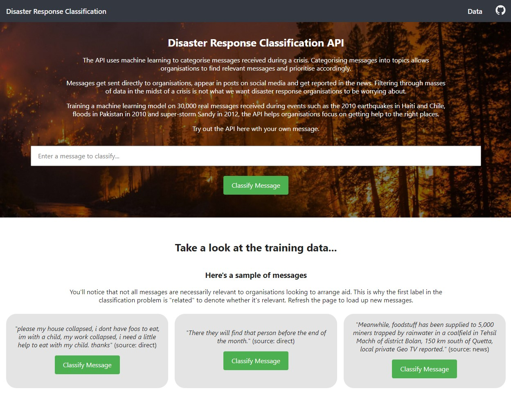
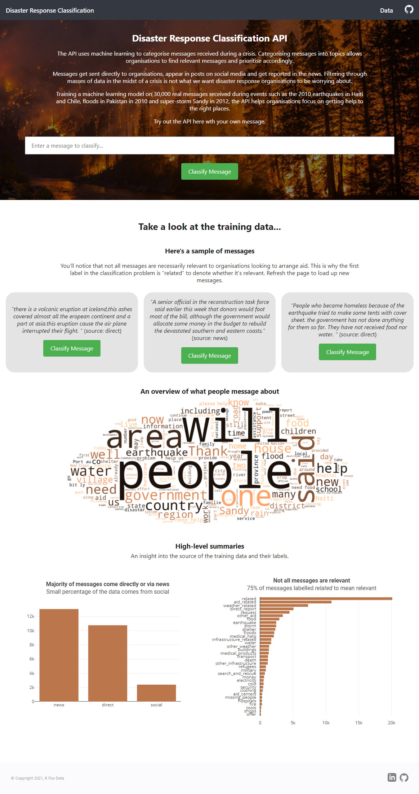
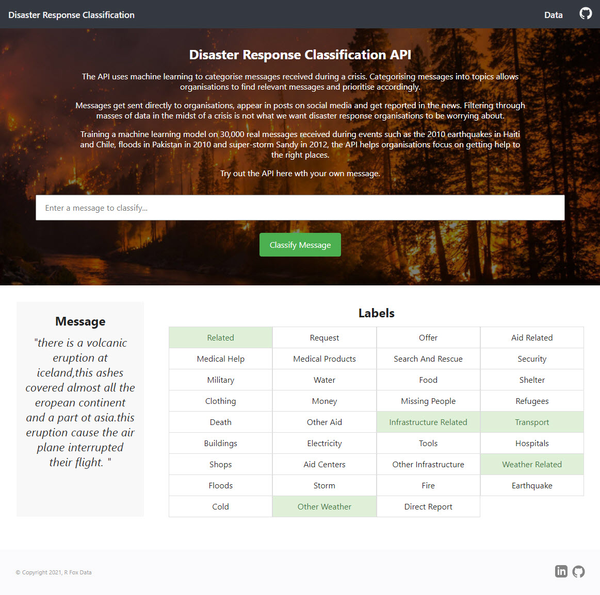

# Disaster Response Classification API

An API that uses machine learning to categorise messages received during a crisis. Training a machine learning model on 30,000 real messages received during events such as the 2010 earthquakes in Haiti and Chile, floods in Pakistan in 2010 and super-storm Sandy in 2012, the API helps organisations focus on getting help to the right places.

See it live [here](https://disaster.rfoxdata.co.uk/).



## Table of Contents

- [Getting Started](#getting-started)
- [Deployment](#deployment)
- [Built With](#built-with)
- [Train New Data](#train-new-data)
- [Screenshots](#screenshots)
- [License](#license)

## Getting Started

These instructions will get you a copy of the project up and running on your local machine for development and testing purposes. See deployment for notes on how to deploy the project on a live system.

### Prerequisites

You will need Python 3.6 or later on your local machine.

### Installing

Clone/fork the repo onto your local machine.

It is then recommended to use a virtual environment to install the dependencies using the `requirements.txt` file.

```cli
pip install -r requirements.txt
```

With these installed, you simply need to run the following from the repo's root working directory.

```cli
python app/run.py
```

Go to http://0.0.0.0:3001/ to see the web app live on your local machine.

## Deployment

I'm using [PythonAnywhere](https://www.pythonanywhere.com/) (free tier available) to host this site. See their simple guide to ["Setting up Flask applications on PythonAnywhere"](https://help.pythonanywhere.com/pages/Flask/).

## Built With

- [Flask](https://flask.palletsprojects.com/en/1.1.x/) - The web application framework used
- [Plotly](https://plotly.com/python/) - For data visualization
- [NLTK](https://www.nltk.org/) - Natural Language Toolkit for text processing methods
- [Scikit-Learn](https://scikit-learn.org/) - Python machine learning library
- [SQLAlchemy](https://www.sqlalchemy.org/) and [SQLite](https://sqlite.org) - SQL toolkit and databse engine
- [Appen (formerly FigureEight)](https://appen.com/) - Training data source
- [PythonAnywhere](https://www.pythonanywhere.com/) - Cloud platform used for deployment

## Train New Data

It is possible to use the repository to train a new dataset although you will need to follow a strict schema. The training data should be separated into two separate CSV files: a messages dataset of exactly four columns and a target labels dataset with any number of columns.

1. Run the following commands in the project's root directory to set up your database and model.

   - To run ETL pipeline that cleans data and stores in database

     ```cli
       python data/process_data.py [path/to/messages.csv] [path/to/categories.csv] [/path/to/database.db]
     ```

     For example, in the current repo, you can run `python data/process_data.py data/disaster_messages.csv data/disaster_categories.csv data/DisasterResponse.db`

   - To run ML pipeline that trains classifier and saves
     `python models/train_classifier.py data/DisasterResponse.db models/classifier.pkl`

1. Run the following command in the app's directory to run your web app.
   `python app/run.py`

1. Go to http://0.0.0.0:3001/ or [localhost:3001](http://localhost:3001/)

## Screenshots

Main page



Classification Results



## License

This project is licensed under the MIT License - see the [LICENSE.md](LICENSE.md) file for details
